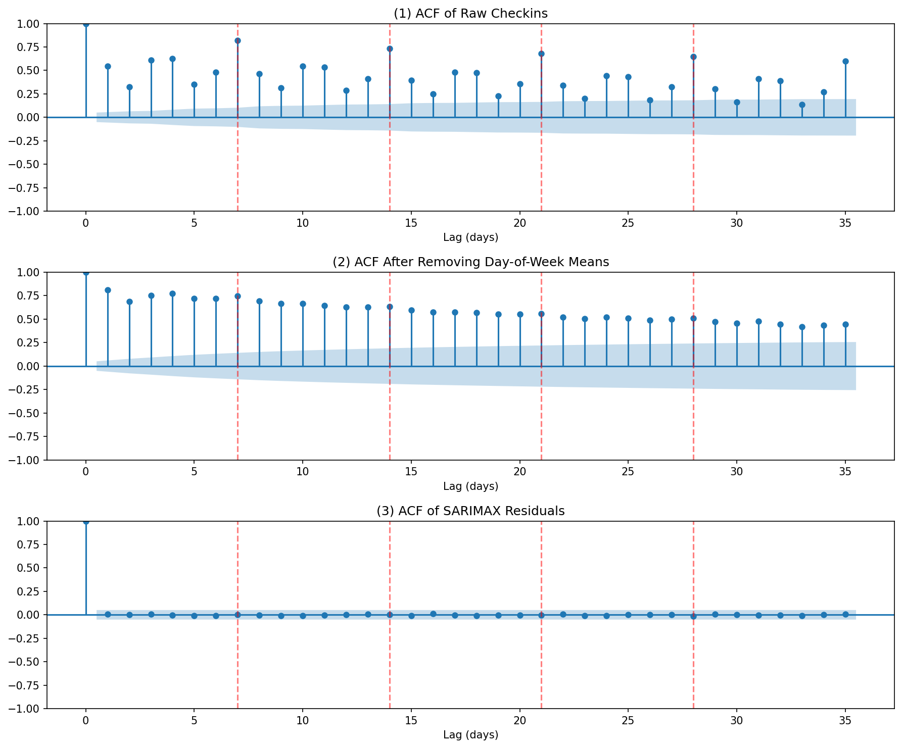
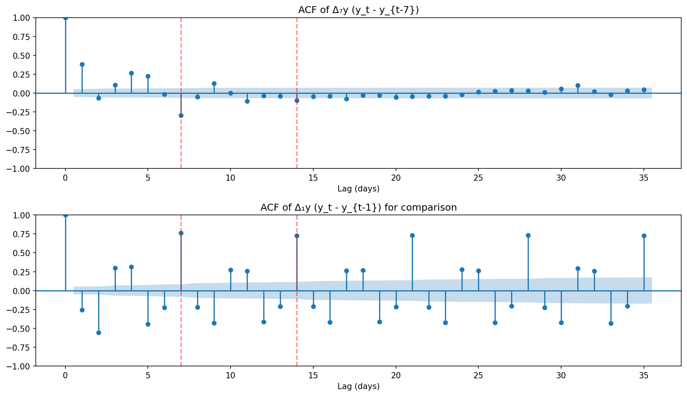
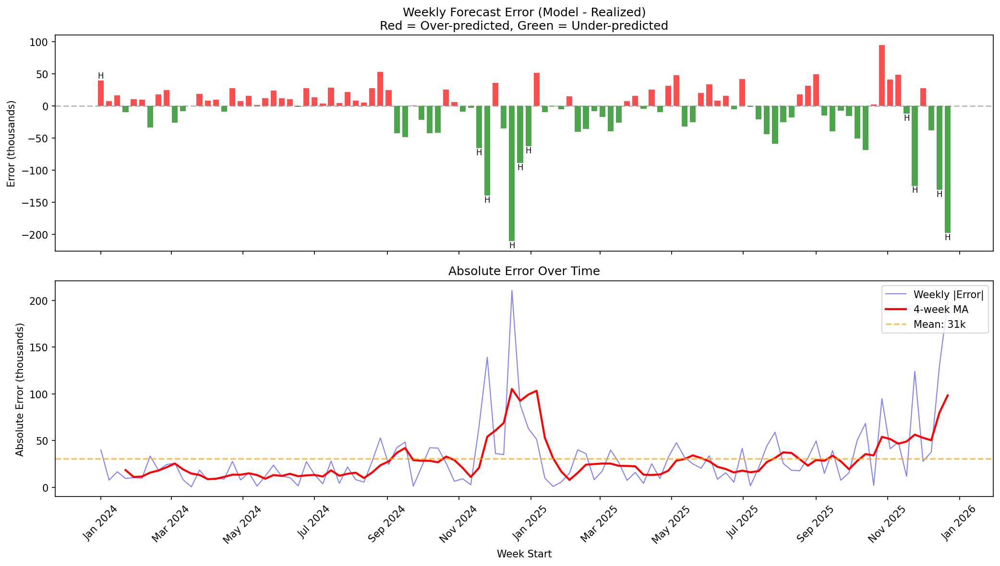

# TSA Checkpoint Forecasting

> **Note:** This repository contains documentation only. Source code, data, and trading infrastructure have been removed as this system is actively deployed in production. This README serves as a reference for the model architecture, methodology, and performance characteristics.

Probabilistic forecasting of weekly TSA checkpoint volumes using a SARIMAX + XGBoost ensemble with Bayesian partial-week conditioning.

## Highlights

- **SARIMAX(1,1,1) x (1,0,0,7)** state-space model with stochastic weekly seasonality
- **XGBoost residual correction** learns nonlinear patterns SARIMAX misses (10% Brier improvement)
- **20 exogenous features** including smoothed seasonal norm, holiday position bins, and pooled pre-travel ramps
- **Partial-week Bayesian conditioning** — observed Mon-Thu data tightens the weekly forecast via Kalman filtering
- **25,000 Monte Carlo simulations** for threshold probability estimation
- **Storm day handling** — NaN imputation lets the Kalman filter propagate state without shock contamination
- **Walk-forward backtesting** with conditioned evaluation across 112+ weeks

## Model Performance

Conditioned backtests (2024-01-01 to 2026-02-22, 112 weeks, 25k simulations):

| Observed Days | Description | MAE (checkins) | MAPE | Brier Score | Dir. Accuracy |
|:---:|---|---:|---:|---:|---:|
| 0 | Unconditional (Mon morning) | 49,088 | 2.04% | 0.0343 | 79.3% |
| 1 | Mon observed | — | — | — | — |
| 2 | Mon-Tue observed | — | — | — | — |
| 3 | Mon-Wed observed | — | — | — | — |
| 4 | Mon-Thu observed | 25,801 | 1.09% | 0.0186 | 91.0% |

Climatology baseline (same-week-last-year x trailing YoY%): MAE 78,948, Brier 0.0527. Model beats climatology by ~35% across all metrics.

Variance ratio near ideal 1.0 across all conditioning levels, confirming well-calibrated uncertainty.

## Visualizations

### Autocorrelation Analysis



Strong weekly periodicity (lag 7) motivates the seasonal AR component.

### ACF After Differencing



First differencing removes trend; residual structure captured by ARMA(1,1).

### Weekly Forecast Errors by Conditioning Level



Forecast error distributions tighten significantly with each additional observed day.

## Model Architecture

### SARIMAX Component

| Property | Value |
|---|---|
| Specification | SARIMAX(1,1,1) x (1,0,0,7) |
| Weekly seasonality | Stochastic AR(1) at period 7 |
| Trend | Integrated via d=1 differencing |
| Training start | 2019-01-01 (fixed) |
| COVID handling | Mar 2020 – Dec 2022 as NaN gap (Kalman propagation) |
| Clean observations | ~1,882 non-NaN |
| Simulations | 25,000 Monte Carlo paths |

Instead of 6 DOW dummy variables, the model uses a seasonal AR(1) at period 7:

```
y_t = seasonal_AR(1,7) + ARMA(1,1) + X_t * beta + epsilon_t
```

This captures day-of-week patterns with a single autoregressive parameter rather than 6 fixed effects, reducing overfitting while allowing the weekly pattern to evolve over time.

### XGBoost Ensemble

The ensemble adds a residual correction layer that learns systematic patterns SARIMAX misses (nonlinear DOW x holiday interactions, monthly patterns):

1. Walk-forward daily residuals collected from SARIMAX
2. Shallow XGBoost trained on residuals with calendar features + lagged residuals
3. Per-day correction predicted in log-space, applied deterministically to all Monte Carlo paths
4. Correction magnitude capped to prevent overcorrection

Average Brier improvement across all conditioning levels: **~10%** (59-week paired test).

### Jensen's Inequality Handling

The model operates in log-space. Point forecasts use the lognormal mean correction:

```
E[Y] = exp(mu + sigma^2 / 2)
```

This ensures unbiased forecasts in level-space despite log-normal transformation.

## Feature Engineering

### 20 Exogenous Features

| Category | Features | Count |
|---|---|---:|
| Seasonal norm | Smoothed DOY median of log-checkins (full annual pattern) | 1 |
| Thanksgiving | Position bins relative to Thursday | 6 |
| Christmas | Position bins relative to Dec 25 | 4 |
| July 4th | Pre/day/post bins | 3 |
| 3-day weekends | MLK, Presidents | 2 |
| Pre-travel ramp | Pooled across MLK, Presidents, Memorial, Easter | 1 |
| Other | Minor holidays, Early January, Halloween week | 3 |
| **Total** | | **20** |

The `seasonal_norm` feature — a smoothed day-of-year median of log-checkins — encodes the full annual level pattern, replacing all 8 Fourier harmonic features while significantly improving unconditional forecast accuracy.

### Holiday Position Bins

Holidays use **position bins relative to an anchor day** rather than nested week+day features:

```
Thanksgiving (anchor = Thursday):
  [-4,-2] tgiving_pre      (Sun-Tue before)
  [-1]    tgiving_eve      (Wed)
  [0]     tgiving_day      (Thu)
  [+1,+2] tgiving_fri_sat  (Fri-Sat)
  [+3]    tgiving_sun      (Sun return)
  [+4,+5] tgiving_after    (Mon-Tue after)
```

This approach:
- Reduces multicollinearity vs. week_type x DOW interaction terms
- Works regardless of which day Christmas falls on
- Needs fewer parameters (6 vs. 14 for 2-week x 7-day encoding)

### Pooled Pre-Travel Ramp

A single `three_day_weekend_pre` feature pools the pre-holiday travel surge across MLK, Presidents Day, Memorial Day, and Easter. This gives ~32-48 day-observations for one coefficient instead of ~8-12 for four separate coefficients, capturing the ~+6.8% daily travel impact reliably.

## Forecasting Pipeline

```
checkins.csv
    |
    v
[Load & Impute Storm Days]  -- NaN for outlier days (robust z-score detection)
    |
    v
[Fit SARIMAX]  -- 2019-01-01 to present, COVID gap as NaN (Kalman propagation)
    |
    v
[Condition on Partial Week]  -- Mon-Thu observed data via Kalman filter update
    |
    v
[XGBoost Residual Correction]  -- Per-day correction in log-space
    |
    v
[Monte Carlo Simulations]  -- Sample from forecast distribution
    |
    v
[Variance Scaling]  -- DOW, seasonal, and conditioning corrections
    |
    v
[Bias Correction]  -- Day-specific shifts from backtest analysis
    |
    v
[Threshold Probabilities]  -- P(weekly_avg > T) for each threshold T
```

### Partial-Week Bayesian Conditioning

When partial-week data is available (e.g., Mon-Wed observed), the Kalman filter conditions the state on observations, then simulates only the remaining days. This dramatically reduces forecast uncertainty:

- **Day 0**: Full 7-day simulation (widest uncertainty)
- **Day 4**: Only 3 days simulated, leveraging 4 observed values (tightest)

### Storm Day Handling

Days with extreme DOW z-scores (computed using robust median/MAD statistics to avoid holiday contamination) are marked as **missing (NaN)** rather than replaced with counterfactual values. This lets the Kalman filter propagate state without a measurement update, preventing manufactured observations from contaminating the seasonal channel.

Protected holidays (Thanksgiving, Christmas, MLK, Presidents, Memorial, July 4th, Easter) are never imputed, even if their z-scores are low — these represent legitimate travel pattern shifts, not weather disruptions.

### Variance Scaling

Three-layer multiplicative variance correction applied per simulated day:

1. **DOW variance ratios**: Empirical σ_dow/σ_overall from fitted residuals
2. **Seasonal multipliers**: Monthly corrections for winter overconfidence and summer underconfidence
3. **Conditioning scalers**: Late-week multipliers correcting underconfidence as weekly average becomes increasingly locked in

### Bias Correction

Day-specific Z-score shifts correct for systematic model bias discovered in backtesting. Days 0-1 have near-zero bias; days 2-4 have small positive bias (model slightly underforecasts), corrected via calibrated Z-shifts.

## Backtesting

### Walk-Forward Methodology

Each week is evaluated using only data available at forecast time:

1. Train model on all data through Sunday before the target week
2. For conditioned backtests: include Mon-Thu of target week as observations
3. Generate 25k simulations of weekly average
4. Evaluate threshold probabilities against realized outcomes
5. Compute Brier scores, MAE, calibration metrics

### Conditioned vs. Unconditional

The backtest evaluates 5 conditioning levels (day 0 through day 4), showing how forecast quality improves as the week progresses. This maps directly to real-world usage: Monday morning forecasts are unconditional, while Thursday forecasts condition on 4 observed days.

### Calibration

The model is well-calibrated across all probability bins:
- Variance ratio near 1.0 on all conditioning days
- Days 0-1 bias near zero after `three_day_weekend_pre` feature
- Days 2-4 have small positive bias (model slightly underforecasts), corrected via Z-shift

## Key Design Decisions

| Decision | Rejected Alternative | Rationale |
|---|---|---|
| Stochastic seasonal AR(1,7) | DOW dummies (6 params) | Fewer parameters, evolving weekly pattern |
| `seasonal_norm` (smoothed DOY median) | 8 Fourier harmonics | -23% Brier, encodes full annual pattern in 1 feature |
| XGBoost residual ensemble | SARIMAX-only | -10% Brier, captures nonlinear DOW×holiday interactions |
| Position bins for holidays | Week-type x DOW interactions | Lower multicollinearity, fewer params |
| Pooled pre-travel ramp | Per-holiday pre-ramp features | 4x more observations per coefficient |
| NaN for storm days | Counterfactual replacement | Kalman propagation avoids shock contamination |
| Robust median/MAD for z-scores | Mean/std | Resistant to holiday spikes inflating stats |
| Fixed 2019 start date | Rolling window | Includes pre-COVID baseline for better seasonal estimates |
| COVID gap as NaN | Drop or interpolate | Kalman filter naturally handles missing data |
| 25k Monte Carlo sims | Analytical quantiles | Handles non-Gaussian tails from log transform |
| Three-layer variance scaling | Single global variance | DOW, seasonal, and conditioning effects each corrected independently |

## Data Source

TSA checkpoint travel numbers are published daily by the [Transportation Security Administration](https://www.tsa.gov/travel/passenger-volumes). The dataset begins January 2019.
